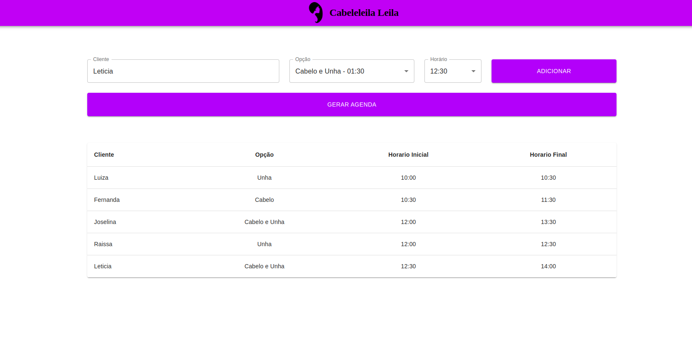
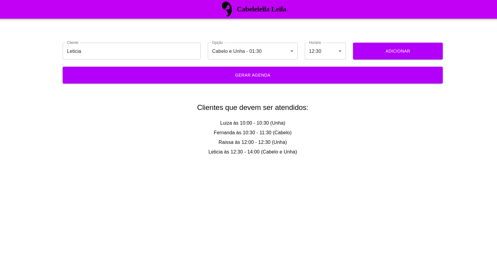
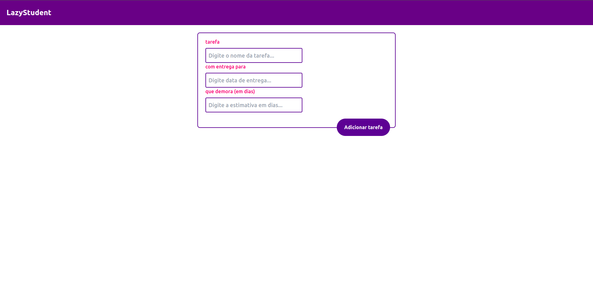
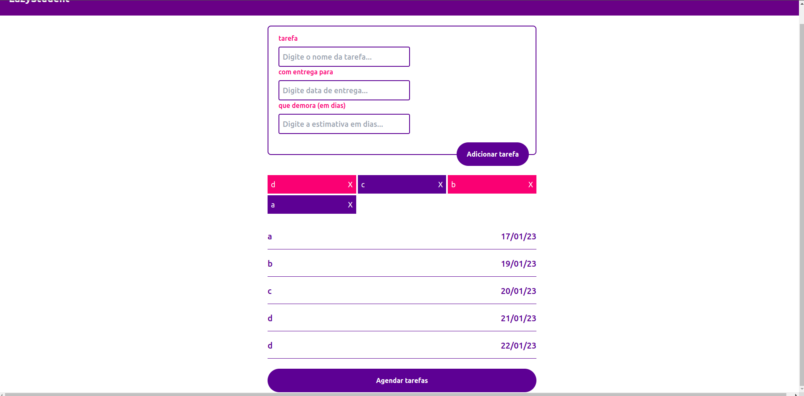

# Cabeleleila Leila & Lazy Studente

**Número da Lista**: 18<br>
**Conteúdo da Disciplina**: Greed<br>

## Alunos
|Matrícula | Aluno |
| -- | -- |
| 18/0041592  |  Denys Rógeres |
| 19/0109963  |  João Victor Batista |


## Sobre 
- <b>Cabeleleila Leila</b> <br>
Com o intuito de ajudar a Cabeleireira a organizar sua agenda, foi realizar o projeto CabeleleilaLeila na qual a usuária poderá cadastrar todas os trabalhos do dia e a aplicação irá ajudar a encontrar quais clientes ela deve atender para atender o máximo de clientes e fideliza-los.

- <b>Lazy Studente</b> <br>
Visto que muitos alunos da FGA possuem o hábito de realizar suas atividades universitárias de última hora, projeto Lazy Student procura auxiliar esses
alunos a organizarem suas agendas. O projeto apresenta um algoritmo inspirado no ambicioso *Job Scheduling* com algumas modificações: são informadas uma lista de tarefas a serem realizadas, cada uma com nome, data de entrega (*deadline*) e nível de dificuldade (expresso em dias de execução) e retorna um vetor contendo qual atividade será realizada em qual dia, sempre adiando o máximo possível.

## Screenshots

### Projeto CabeleleilaLeila



### Projeto LazyStudent



## Video de Apresentação

[Video](apresentacao_greed.mp4)

### Requisitos 
- *npm* ou *yarn*
- node v16

### Instalação
Para instalar o projeto, bastar seguir os seguintes comandos:
```
$ git clone https://github.com/projeto-de-algoritmos/Greed_.git
```
Em seguida é preciso mudar para a branch main (Projeto CabeleleilaLeila) ou lazy-student(LazyStudent) utilizando o seguinte comando:
```
$ git checkout main
```
ou
```
$ git checkout lazy-student
```

E instalar o projeto com o comando:
```
$ npm install
```

Para inicializar o projeto digite o comando:
```
$ npm run dev
```

ou 

```
$ yarn dev
```

## Uso 
Abrir a aplicação pelo endereço http://localhost:5173

